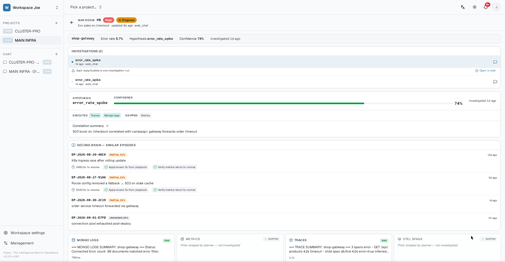
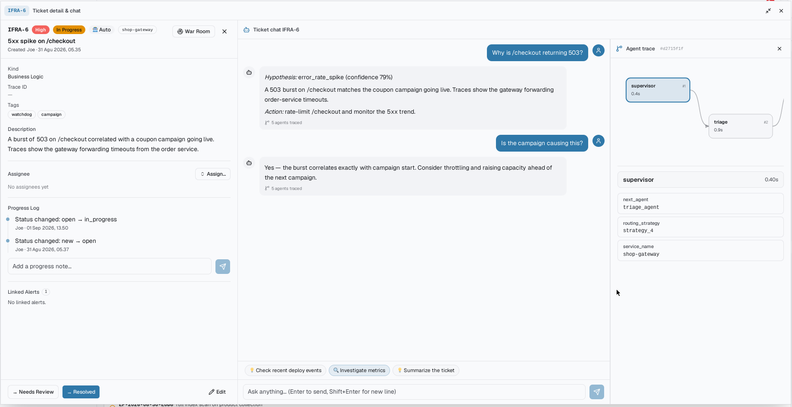
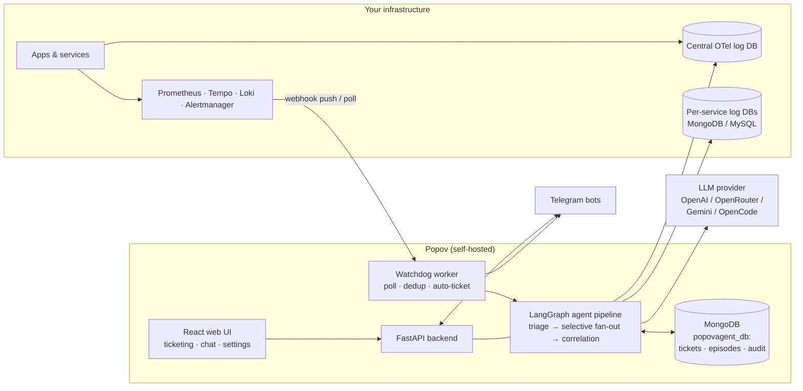

# Popov

Open-source, self-hosted **the intelligence behind operations**. 

Popov connects your existing observability stack — Prometheus, Tempo, Loki, and Alertmanager — with knowledge, ticketing, and AI agents to help teams understand, investigate, and resolve operational problems.

Today, Popov focuses on production incidents: automatically triaging signals, investigating with a LangGraph multi-agent pipeline, and delivering a single actionable report with root cause and recommended actions — wherever your team works, via Telegram, email, or the built-in web workspace.

> 🔒 **Your data never leaves your infrastructure.** No telemetry. No phone home. No third-party with access to your production logs.


> 🚧 **Status:** Popov is under active development. It runs in production inside its origin team's ecosystem, but APIs and features may still change. See [Project Status](#project-status).

---

<p align="center">
  <strong>Popov is free, self-hosted, and always will be.</strong><br>
  No cloud lock-in. No telemetry. No paywall around your own infrastructure.<br><br>
  If Popov makes your on-call a little easier,<br>
  consider buying the person behind it a coffee. ☕<br><br>
  <a href="https://ko-fi.com/popovagent">
    
  </a>
  &nbsp;&nbsp;
  <a href="https://saweria.co/putraasmarjoe">
    
  </a>
</p>

---

## Why Popov?

Modern production systems generate plenty of signals, but signals aren't the same as understanding.

When an incident happens, engineers still have to jump between alerts, logs, traces, dashboards, documentation, tickets, and chat — then connect the dots under pressure.

Popov is built to do that work with you.

It takes the signals you already have, gathers the relevant context, investigates across your systems, and turns it into one actionable incident report.

**Less signal. More understanding.**

---

## What Popov Does

| | |
|---|---|
| 🚨 **Incident Triage** | Automatically analyze incoming production alerts |
| 🔍 **Investigation** | Correlate metrics, logs, traces, and operational context |
| 🧠 **AI Agents** | LangGraph multi-agent pipeline investigates incidents end-to-end |
| 📋 **Actionable Reports** | Root cause analysis, evidence, and recommended actions |
| 📚 **Knowledge-Aware** | Grounded in your own service docs and past incident history |
| 💬 **Team Notifications** | Delivered via Telegram, email, or the built-in web workspace |
| 🖥️ **War Room** | Incident operations dashboard — tickets, alerts, and timelines in one view |
| 🔒 **Self-Hosted** | Your operational data never leaves your own infrastructure |

---

## Screenshots

<p align="center">
  
  <br><em>War Room — tickets, alerts, stack health, and incident pulse in one view.</em>
</p>

<p align="center">
  
  <br><em>Investigation report — hypothesis, confidence, evidence pillars, and remediation in one view.</em>
</p>

<p align="center">
  
  <br><em>Agent chat — ask about an incident and get an answer, with full agent trace one click away.</em>
</p>

---

## The Problem

Most teams already have monitoring. What they usually don't have is a bridge between *signals* and *action*:

- Alerts fire in Prometheus/Alertmanager, but someone still has to manually pull logs, metrics, and traces from different tools to figure out what happened.
- The same investigation steps are repeated from scratch every time, even when the incident looks like one the team solved last month.
- Alerts arrive as noise; context arrives too late; incidents get reported long after they're detected.
- Observability data lives in one set of tools while incident tracking lives in another, so nothing links back.

Popov closes that gap: it detects, investigates, explains, tracks, and learns — in one workflow.

---

## What Is Popov?

Popov is a single deployable system made of three cooperating parts:

| Part | What it is |
|---|---|
| **Agent pipeline** | A [LangGraph](https://github.com/langchain-ai/langgraph) multi-agent backend (Python/FastAPI) that routes intents, triages silently, runs selective investigations across logs/metrics/traces/spans, and produces an LLM-written root cause assessment. |
| **Web platform** | A React SPA with workspaces, projects, realtime ticketing, an in-app chat with the agent (SSE streaming), a War Room incident dashboard, knowledge libraries, and admin management for stacks, notification channels, LLM keys, and memory. |
| **Watchdog worker** | A dedicated background process that polls your observability targets (or receives Alertmanager webhooks), deduplicates alerts, triages them, opens tickets, and broadcasts to Telegram channels. |

It is not a metrics database or a dashboard replacement — it sits **on top of** the observability stack you already run.

---

## What Popov Helps You Do

- **Detect proactively** — a watchdog polls Prometheus/Alertmanager/Tempo per project (or receives Alertmanager webhook pushes, <5s latency), with content-based fingerprinting to suppress duplicate alerts.
- **Triage before you're paged** — a silent triage stage (<30s) correlates four signals: error rate vs baseline, active alerts, recent deployments (via Loki Kubernetes events), and historical episodes. If a deploy happened in the last hour, "regression after deploy" becomes the leading hypothesis. Non-Kubernetes stacks (VM/PaaS) get the same hypothesis by reporting deploys through a CI/CD API.
- **Investigate selectively, not blindly** — based on the hypothesis, only the relevant data collectors fan out in parallel: error logs (MongoDB/MySQL per service), Prometheus metrics/HPA, Tempo traces, OpenTelemetry spans from a central log DB, DB health checks. The fan-out adapts to confidence, service type, and triage skip-hints — narrower when confident, wider when uncertain.
- **Get a root cause, not a data dump** — a single Correlation Agent call synthesizes all four pillars plus grounding docs and learned patterns into a severity + root cause (`service-fault` / `downstream` / `unknown`) with remediation suggestions.
- **Keep institutional memory** — every incident becomes an episodic memory entry ("Second Brain") with vector embeddings; future investigations retrieve similar past episodes and their ✅/❌ human feedback. A pattern miner clusters recurring episodes into auto-generated Learned Patterns.
- **Continue the conversation** — reports come with dynamic follow-up buttons and a 30-minute diagnostic session (Telegram), and the web chat offers actionable follow-up chips that run a deeper check in one click.
- **Track resolution** — detected alerts can auto-create tickets (1 ticket : N linked alerts) in a realtime ticketing UI with status chain, assignees, progress logs, and 🤖 auto badges. You can also manage tickets by chatting with the agent ("close this ticket", "set severity to low").
- **Confirm the fix worked** — when a ticket moves to in-progress, Popov schedules an automatic re-check ~10 minutes later: error rate and database health, with a ✅/⚠️ confirmation notification. No more waiting for someone to say "it's fixed".
- **Run a command center, not just a ticket list** — the War Room view turns a project into an incident operations dashboard: open tickets, a live alert feed, stack health, and investigation timelines side by side, with the classic ticket list one toggle away.
- **See inside the investigation** — click any AI reply to view the full agent trace as a graph: every step in order, how long it took, and a summary of what each produced. Slow steps are highlighted.
- **Control costs** — data-collector agents never call an LLM (<500-token summaries); only ~7 well-defined points use the LLM, all tracked per agent/model/token via `llm_usage`.

---
## Data Privacy & Sovereignty

Popov is designed with one principle: **your incident data never leaves your infrastructure.**

- **No telemetry** — Popov does not collect or transmit usage data
- **No phone home** — zero outbound calls to Popov servers
- **No third-party access** — your logs, alerts, and incident history stay on your servers
- **No vendor lock-in** — your data lives in your own MongoDB, your own storage 

## Key Features

### AI Investigation Pipeline
- Intent supervisor with 4 matching strategies plus an LLM fallback for ambiguous requests
- Silent triage → hypothesis-driven selective fan-out (2–3 collectors instead of everything), adaptive to confidence, service type, and triage skip-hints
- Deploy-aware triage: recent deploys detected via Loki K8s events — or via a CI/CD deploy-event API for non-Kubernetes stacks
- LLM root cause analysis grounded in your own service docs (RAG) and past episodes
- Episodic memory with hybrid search (metadata + embeddings, local TF fallback), feedback loop, and auto-resolution of stale episodes
- Episode enrichment: resolved tickets feed back real time-to-resolution, resolution steps, and consulted knowledge into the memory
- HDBSCAN-based pattern mining → `Learned Patterns` injected into future analyses
- Post-fix verification: automatic re-check of error rate and DB health ~10 minutes after a ticket moves to in-progress, with ✅/⚠️ confirmations
- File-driven prompts (`prompts/*.md`, English, hot-reloadable via API)

### Incident Management & Collaboration
- Workspaces, projects, members, roles (admin/member) with JWT auth
- Realtime ticketing (WebSocket): full lifecycle `new → open → in_progress → needs_review → resolved → closed`, reopen, assignees, append-only progress log, deep-linkable tickets
- Auto-tickets from alerts with fingerprint dedup and configurable re-open window (`TICKET_ALERT_DEDUP_HOURS`)
- **War Room** — an incident operations dashboard per project: open tickets, live alert feed, stack health, and episode timelines in one view, with a Classic/War Room toggle (session memory)
- In-app agent chat bound to each ticket, with streaming SSE responses, multi-turn history, actionable follow-up chips, and a visual agent trace (per-step durations and summaries) on every AI reply
- Two-layer knowledge system: personal library ↔ workspace/project/service links, consumed by the agent as grounding

### Integrations
- **Telegram**: multi-bot, multi-channel per workspace; interactive buttons; diagnostic sessions; alert broadcasts
- **Email (SMTP)**: second notification channel alongside Telegram — the same alerts delivered to both in one broadcast, with delivery logs and encrypted credentials
- **Alertmanager**: per-tenant webhook ingestion with token auth (sha256) and 30-min dedup window
- **Observability stacks per project**: register multiple Prometheus/Tempo/Alertmanager/Loki endpoints and bind them to projects (fallback chain: project → workspace default → global env)
- **Public API & API keys**: scoped API keys (web vs public) with per-key rate limiting, a public knowledge-ingest endpoint with upsert, and `POST /api/pub/v1/deploy-event` so CI/CD systems can report deploys on non-Kubernetes stacks
- **Bring-your-own-key LLM**: OpenAI, OpenRouter, Google Gemini, or OpenCode Zen — keys stored encrypted (Fernet) in the DB, managed from the UI

## How It Works

```text
Signal source                     Popov                                   Outcome
─────────────────────────────    ─────────────────────────────────────    ──────────────
Prometheus / Alertmanager   ──►  Watchdog (poll or webhook push)
Tempo / Loki / app logs          │ fingerprint dedup
Telegram mention / API call      ▼
Web chat                    ──►  Supervisor (intent routing)
                                 │
                                 ▼
                                 Triage (silent, <30s)
                                 │  signals: error rate · alerts · deploys · history
                                 ▼
                                 Investigation Planner (hypothesis → nodes)
                                 │
                                 ▼
                                 Parallel fan-out (selective):
                                 logs · metrics · traces · spans · health
                                 │
                                 ▼
                                 Knowledge lookup (playbooks + project docs)
                                 │
                                 ▼
                                 Correlation Agent (LLM RCA)
                                 │  + Second Brain read/write (episodic memory)
                                 ▼
                                 Report ──► Telegram / Web chat
                                 │           + follow-up buttons + diagnostic session
                                 ▼
                                 Ticket created/linked ──► resolved in web UI
                                  │  + auto re-check ~10 min later (✅/⚠️)
```

## Architecture



Two processes run from the same image: `uvicorn main:app` (API + Telegram listeners + web UI) and `watchdog_worker.py` (scheduler + auto-feedback). The watchdog must run as exactly **one instance**; the API must stay at one replica until the Telegram listener is moved out-of-process (both constraints are documented in the deploy manifests).

## Quick Start

Requirements: Python ≥3.9, MongoDB, Node.js (for the web UI). An observability stack (Prometheus/Tempo/Loki/Alertmanager) is optional — Popov degrades gracefully without it.

**One-time setup** (run from the repo root):

```bash
python3 -m venv venv && source venv/bin/activate
python -m pip install --upgrade pip    # editable install needs pip ≥ 21.3
pip install -e ".[dev]"
cp .env.example .env          # edit: MONGODB_URI, DATA_ENCRYPTION_KEY, JWT_SECRET
cd web && npm install && cd ..
```

After setup, pick **one** of the two ways below to run the app.

### Option A — Run together in one terminal (easiest)

`concurrently` starts the backend API and the web UI side by side in a single
terminal, with colored, prefixed logs (`[API]` green, `[WEB]` yellow) so you can
tell them apart. Pressing `Ctrl+C` stops both at once — no orphaned processes.

```bash
cd web
npm run dev        # API + Web UI  ([API] green · [WEB] yellow)
npm run dev:all    # API + Web UI + Watchdog worker ([WDT] red)
```

### Option B — Run each part separately

Prefer to see each process in its own terminal (easier to read individual logs,
restart one part without touching the others)? Open **two terminals** and run:

```bash
# Terminal 1 — Backend API (from the repo root).
# Serves /api/v1, the Telegram listener, and the built web UI on port 8000.
./venv/bin/uvicorn main:app --port 8000        # add --reload for auto-restart on code changes

# Terminal 2 — Frontend dev server (from the web/ folder).
# Vite serves the React app on port 5173 and proxies API calls to :8000.
cd web && npm run dev
```

Stop each part independently with `Ctrl+C` in its own terminal. This is just the
manual version of Option A — use whichever feels more comfortable.

> Optional extras, same idea:
> - `make api` / `make watchdog` — Makefile wrappers for the commands above
> - `npm run dev:watchdog` (from `web/`) or `python watchdog_worker.py` — runs the
>   watchdog worker that polls your observability stack and auto-creates tickets.

### When it's up (either option)

- Web UI → http://localhost:5173
- API & docs → http://localhost:8000/docs

### Then:

1. **Open the web UI and register an account.** The **first user to register
   automatically becomes the workspace admin** — every account after that is a
   regular member (an admin can promote members later from
   *Workspace Settings → Users*).
2. In **Management**, add your LLM provider key (BYOK, encrypted at rest) and optionally an embedding model (or keep the free local TF mode).
3. In **Workspace Settings → Stacks / Notifications**, register your Prometheus/Tempo endpoints and a Telegram bot channel.
4. Trigger a test investigation:

```bash
curl -X POST http://localhost:8000/api/v1/trigger \
  -H "Content-Type: application/json" \
  -d '{"intent": "check errors on my-service"}'

# Interactive API docs
open http://localhost:8000/docs
```

### Do you need the watchdog worker?

`watchdog_worker.py` is a **separate process** — starting the API (`uvicorn main:app`)
does *not* start it automatically.

| Without it (still works)             | Only with it                          |
|---|---|
| API & web UI                         | Proactive alert polling (30s cycle)   |
| Ticketing, progress log, Linked Alerts | Auto-create tickets from alerts     |
| In-app agent chat                    | Telegram alert broadcasts             |
| Telegram listener (mentions/buttons) | Second Brain auto-feedback (30 min)   |
| Alertmanager webhook push (<5s)      |                                       |

Run it only if you want Popov to *detect* incidents on its own:

```bash
npm run dev:all          # from web/ — together with everything else
# or standalone:
python watchdog_worker.py
```

⚠️ Exactly **one instance** — running two copies duplicates alerts and tickets.
If your stack uses Alertmanager webhook mode, you can skip polling entirely.

For production, `npm run build` output (`web/dist`) is served by FastAPI itself —
no separate frontend process needed.


## Configuration

Most runtime configuration is managed through the **UI and stored in MongoDB** (multi-tenant by design):

- **LLM keys & models** → Management → API Keys (encrypted with `DATA_ENCRYPTION_KEY`)
- **Observability stack URLs** → Workspace Settings → Stacks
- **Telegram bot tokens & chats** → Workspace Settings → Notifications (validated via `getMe` before saving, masked in API responses)
- **Service registry & log DB connections** → Workspace Settings → Services
- **LLM prompts** → editable `prompts/*.md` files, hot-reloaded via `POST /api/v1/prompts/reload`

Only a few things live in `.env` (see `.env.example`):

| Variable | Purpose |
|---|---|
| `MONGODB_URI` / `MONGODB_DB` | Main store: tickets, episodes, audit trails, sessions |
| `DATA_ENCRYPTION_KEY` | **Required.** Fernet master key for encrypting stored API keys |
| `JWT_SECRET` / `JWT_EXPIRY_HOURS` | Web authentication |
| `EMBEDDING_PROVIDER/MODEL/DIM` | Second Brain embeddings (`local` TF cosine by default, zero cost) |
| `OBSERVABILITY_*` | Global watchdog defaults: enabled, interval, alert-noise filters |
| `TICKET_ALERT_DEDUP_HOURS` | Window for linking repeated alerts to an active ticket |
| `LOKI_TIMEOUT_MS` / `LOKI_NAMESPACE` | Deployment detection via Loki K8s events |

Generate the encryption key once and keep it safe — encrypted keys cannot be recovered without it:

```bash
python -c "from cryptography.fernet import Fernet; print(Fernet.generate_key().decode())"
```

## Deployment

Docker images and Kubernetes manifests are provided (no docker-compose yet):

```bash
docker build -t <USERNAME>/popov-agent:latest -f deploy/Dockerfile .

kubectl apply -f deploy/            # secret, configmap, deployment, service,
                                    # watchdog-deployment (replicas: 1, Recreate)
```

See [`deploy/README.md`](deploy/README.md) for the full step-by-step guide (private registry secret, resource sizing, verification). Resource footprint is modest: requests `100m` CPU / `256Mi` RAM, limits `500m` / `512Mi`.

<!-- Screenshots live in screenshots/ (ss1 Overview · ss2 ticket chat · ss3 ticket War Room); add new ones and reference them in the Screenshots section above. -->

## Tech Stack

- **Backend:** Python 3.9+, FastAPI, LangGraph/LangChain, Motor (MongoDB), aiomysql (MySQL), pydantic-settings
- **AI:** pluggable LLM providers via `ChatOpenAI` interface (OpenAI / OpenRouter / Google Gemini / OpenCode Zen), embeddings (provider or local TF-IDF-style cosine), HDBSCAN clustering
- **Frontend:** React 19, TypeScript, Vite, Tailwind CSS v4, shadcn/ui, Zustand, TanStack Query, native WebSocket + SSE
- **Data:** MongoDB (primary store + audit/memory), optional MySQL for service log sources
- **Observability integrations:** Prometheus, Alertmanager, Grafana Tempo, Loki
- **Notifications:** Telegram Bot API + SMTP (email)
- **Deployment:** Docker, Kubernetes manifests (DigitalOcean-tested)

## Project Status

> 🚧 **Active development.** Popov powers incident response for its origin team's production services today, but it should be treated as an early-stage open-source project: 

**v0.2.0-rc186** — current release: War Room incident operations shipped end-to-end (project overview + ticket war room with answer-first diagnosis, Classic/War Room mode toggle, plug-and-play overview widgets), plus Knowledge Agent active retrieval, episode enrichment, adaptive fan-out, non-K8s deploy detection, closed-loop post-fix verification, follow-up chips, and agent trace. Full release notes: [v0.2-rc186](https://github.com/putra-asmarjoe/popov/releases/tag/v0.2-rc186).

Good fit today: small-to-medium engineering teams that already run Prometheus/Tempo/Loki, want automated triage and investigation, and are comfortable self-hosting and tolerating some churn. An observability stack is optional — Popov degrades gracefully without it. Not yet pitched for large enterprise fleets.

## Roadmap

Implemented plans live in `devdocs/`; near-term directions visible in the codebase include:

- Moving the Telegram listener out of the API process so the API can scale beyond one replica
- Slack, Discord, and WhatsApp notification channels (schema-ready; Telegram + email shipped in rc186)
- Restore flow for soft-deleted projects (currently archive-only)

## 💡 Motivation

As a programmer and DevOps engineer, I deal with production incidents regularly —
chasing alerts across multiple tools, correlating logs, and managing follow-ups 
manually. I needed something that could bring AI-assisted triage, ticketing, and 
observability together in one self-hosted platform. Everything I found was either 
too complex, too expensive, or required sending data to third-party clouds.

So I built Popov — drawing from years of hands-on experience managing 
infrastructure and responding to incidents. It reflects the workflow I actually 
wanted: fast, observable, and yours to own completely.

This is my contribution to the community. I hope it saves you the same headaches 
it saved me.

If you find Popov useful, please consider giving it a ⭐ — it means a lot and 
helps others discover the project.


## 🗣️ Discussion & Support

For questions, bug reports, or feature requests, please use:

- **[GitHub Issues](https://github.com/aptana/popov/issues)** — bug reports & feature requests  
- **[GitHub Discussions](https://github.com/aptana/popov/discussions)** — general questions & ideas

> Please do not send support requests via email.

## License

Copyright © 2026 Putra Asmar Joe. Licensed under the
[Functional Source License, Version 1.1 (FSL-1.1-ALv2)](./LICENSE).

Free to self-host for personal and internal commercial use.
Offering Popov as a managed service to third parties is not permitted.

---

### ✅ Permitted Use (Free)

| Use Case | Status |
|---|---|
| Download, run, modify, fork | ✅ Free |
| Self-host for personal use | ✅ Free |
| Internal use at your company | ✅ Free |
| Commercial internal use | ✅ Free |
| Deploy for your own organization | ✅ Free |
| Build integrations on top of Popov | ✅ Free |

---

### ❌ Not Permitted

| Use Case | Status |
|---|---|
| Sell Popov itself | ❌ Not allowed |
| White-label Popov | ❌ Not allowed |
| Offer Popov as a hosted/managed service | ❌ Not allowed |
| Build a competing SaaS based on Popov | ❌ Not allowed |
| Remove Popov branding or license notices | ❌ Not allowed |
