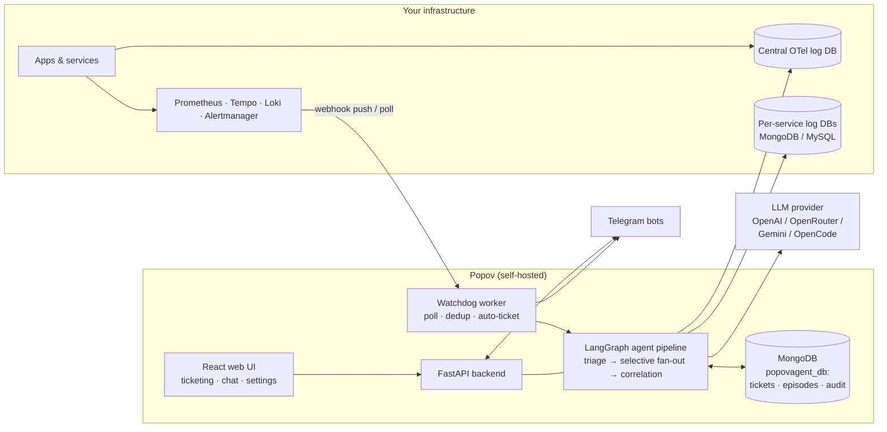

# Popov

Open-source, self-hosted **AI incident response platform**. Popov connects to your existing observability stack (Prometheus, Tempo, Loki, Alertmanager), automatically triages and investigates production incidents with a LangGraph multi-agent pipeline, and delivers one actionable report — with root cause — to Telegram or a built-in web workspace with ticketing.

> 🚧 Popov is under active development. It runs in production inside its origin team's ecosystem, but APIs and features may still change. See [Project Status](#project-status).

---

## The Problem

Most teams already have monitoring. What they usually don't have is a bridge between *signals* and *action*:

- Alerts fire in Prometheus/Alertmanager, but someone still has to manually pull logs, metrics, and traces from different tools to figure out what happened.
- The same investigation steps are repeated from scratch every time, even when the incident looks like one the team solved last month.
- Alerts arrive as noise; context arrives too late; incidents get reported long after they're detected.
- Observability data lives in one set of tools while incident tracking lives in another, so nothing links back.

Popov closes that gap: it detects, investigates, explains, tracks, and learns — in one workflow.

## What Is Popov?

Popov is a single deployable system made of three cooperating parts:

| Part | What it is |
|---|---|
| **Agent pipeline** | A [LangGraph](https://github.com/langchain-ai/langgraph) multi-agent backend (Python/FastAPI) that routes intents, triages silently, runs selective investigations across logs/metrics/traces/spans, and produces an LLM-written root cause assessment. |
| **Web platform** | A React SPA with workspaces, projects, realtime ticketing, an in-app chat with the agent (SSE streaming), knowledge libraries, and admin management for stacks, notification channels, LLM keys, and memory. |
| **Watchdog worker** | A dedicated background process that polls your observability targets (or receives Alertmanager webhooks), deduplicates alerts, triages them, opens tickets, and broadcasts to Telegram channels. |

It is not a metrics database or a dashboard replacement — it sits **on top of** the observability stack you already run.

## What Popov Helps You Do

- **Detect proactively** — a watchdog polls Prometheus/Alertmanager/Tempo per project (or receives Alertmanager webhook pushes, <5s latency), with content-based fingerprinting to suppress duplicate alerts.
- **Triage before you're paged** — a silent triage stage (<30s) correlates four signals: error rate vs baseline, active alerts, recent deployments (via Loki Kubernetes events), and historical episodes. If a deploy happened in the last hour, "regression after deploy" becomes the leading hypothesis.
- **Investigate selectively, not blindly** — based on the hypothesis, only the relevant data collectors fan out in parallel: error logs (MongoDB/MySQL per service), Prometheus metrics/HPA, Tempo traces, OpenTelemetry spans from a central log DB, DB health checks.
- **Get a root cause, not a data dump** — a single Correlation Agent call synthesizes all four pillars plus grounding docs and learned patterns into a severity + root cause (`service-fault` / `downstream` / `unknown`) with remediation suggestions.
- **Keep institutional memory** — every incident becomes an episodic memory entry ("Second Brain") with vector embeddings; future investigations retrieve similar past episodes and their ✅/❌ human feedback. A pattern miner clusters recurring episodes into auto-generated Learned Patterns.
- **Continue the conversation** — reports come with dynamic follow-up buttons and a 30-minute diagnostic session, so you can drill down ("show health", "check traces") without retyping anything.
- **Track resolution** — detected alerts can auto-create tickets (1 ticket : N linked alerts) in a realtime ticketing UI with status chain, assignees, progress logs, and 🤖 auto badges. You can also manage tickets by chatting with the agent ("close this ticket", "set severity to low").
- **Control costs** — data-collector agents never call an LLM (<500-token summaries); only ~7 well-defined points use the LLM, all tracked per agent/model/token via `llm_usage`.

## Key Features

### AI Investigation Pipeline
- Intent supervisor with 4 matching strategies plus an LLM fallback for ambiguous requests
- Silent triage → hypothesis-driven selective fan-out (2–3 collectors instead of everything)
- LLM root cause analysis grounded in your own service docs (RAG) and past episodes
- Episodic memory with hybrid search (metadata + embeddings, local TF fallback), feedback loop, and auto-resolution of stale episodes
- HDBSCAN-based pattern mining → `Learned Patterns` injected into future analyses
- File-driven prompts (`prompts/*.md`, English, hot-reloadable via API)

### Incident Management & Collaboration
- Workspaces, projects, members, roles (admin/member) with JWT auth
- Realtime ticketing (WebSocket): full lifecycle `new → open → in_progress → needs_review → resolved → closed`, reopen, assignees, append-only progress log, deep-linkable tickets
- Auto-tickets from alerts with fingerprint dedup and configurable re-open window (`TICKET_ALERT_DEDUP_HOURS`)
- In-app agent chat bound to each ticket, with streaming SSE responses and multi-turn history
- Two-layer knowledge system: personal library ↔ workspace/project/service links, consumed by the agent as grounding

### Integrations
- **Telegram**: multi-bot, multi-channel per workspace; interactive buttons; diagnostic sessions; alert broadcasts
- **Alertmanager**: per-tenant webhook ingestion with token auth (sha256) and 30-min dedup window
- **Observability stacks per project**: register multiple Prometheus/Tempo/Alertmanager/Loki endpoints and bind them to projects (fallback chain: project → workspace default → global env)
- **Bring-your-own-key LLM**: OpenAI, OpenRouter, Google Gemini, or OpenCode Zen — keys stored encrypted (Fernet) in the DB, managed from the UI

## How It Works

```text
Signal source                     Popov                                   Outcome
─────────────────────────────    ─────────────────────────────────────    ──────────────
Prometheus / Alertmanager   ──►  Watchdog (poll or webhook push)
Tempo / Loki / app logs          │ fingerprint dedup
Telegram mention / API call      ▼
Web chat                    ──►  Supervisor (intent routing)
                                 │
                                 ▼
                                 Triage (silent, <30s)
                                 │  signals: error rate · alerts · deploys · history
                                 ▼
                                 Investigation Planner (hypothesis → nodes)
                                 │
                                 ▼
                                 Parallel fan-out (selective):
                                 logs · metrics · traces · spans · health
                                 │
                                 ▼
                                 Knowledge lookup (playbooks + project docs)
                                 │
                                 ▼
                                 Correlation Agent (LLM RCA)
                                 │  + Second Brain read/write (episodic memory)
                                 ▼
                                 Report ──► Telegram / Web chat
                                 │           + follow-up buttons + diagnostic session
                                 ▼
                                 Ticket created/linked ──► resolved in web UI
```

## Architecture



Two processes run from the same image: `uvicorn main:app` (API + Telegram listeners + web UI) and `watchdog_worker.py` (scheduler + auto-feedback). The watchdog must run as exactly **one instance**; the API must stay at one replica until the Telegram listener is moved out-of-process (both constraints are documented in the deploy manifests).

## Quick Start

Requirements: Python ≥3.9, MongoDB, Node.js (for the web UI). An observability stack (Prometheus/Tempo/Loki/Alertmanager) is optional — Popov degrades gracefully without it.

**One-time setup** (run from the repo root):

```bash
python3 -m venv venv && source venv/bin/activate
pip install -e ".[dev]"
cp .env.example .env          # edit: MONGODB_URI, DATA_ENCRYPTION_KEY, JWT_SECRET
cd web && npm install && cd ..
```

After setup, pick **one** of the two ways below to run the app.

### Option A — Run together in one terminal (easiest)

`concurrently` starts the backend API and the web UI side by side in a single
terminal, with colored, prefixed logs (`[API]` green, `[WEB]` yellow) so you can
tell them apart. Pressing `Ctrl+C` stops both at once — no orphaned processes.

```bash
cd web
npm run dev        # API + Web UI  ([API] green · [WEB] yellow)
npm run dev:all    # API + Web UI + Watchdog worker ([WDT] red)
```

When it's up:

- Web UI → http://localhost:5173
- API & docs → http://localhost:8000/docs

### Option B — Run each part separately

Prefer to see each process in its own terminal (easier to read individual logs,
restart one part without touching the others)? Open **two terminals** and run:

```bash
# Terminal 1 — Backend API (from the repo root).
# Serves /api/v1, the Telegram listener, and the built web UI on port 8000.
./venv/bin/uvicorn main:app --port 8000        # add --reload for auto-restart on code changes

# Terminal 2 — Frontend dev server (from the web/ folder).
# Vite serves the React app on port 5173 and proxies API calls to :8000.
cd web && npm run dev
```

Stop each part independently with `Ctrl+C` in its own terminal. This is just the
manual version of Option A — use whichever feels more comfortable.

> Optional extras, same idea:
> - `make api` / `make watchdog` — Makefile wrappers for the commands above
> - `npm run dev:watchdog` (from `web/`) or `python watchdog_worker.py` — runs the
>   watchdog worker that polls your observability stack and auto-creates tickets.

### Do you need the watchdog worker?

`watchdog_worker.py` is a **separate process** — starting the API (`uvicorn main:app`)
does *not* start it automatically.

| Without it (still works)             | Only with it                          |
|---|---|
| API & web UI                         | Proactive alert polling (30s cycle)   |
| Ticketing, progress log, Linked Alerts | Auto-create tickets from alerts     |
| In-app agent chat                    | Telegram alert broadcasts             |
| Telegram listener (mentions/buttons) | Second Brain auto-feedback (30 min)   |
| Alertmanager webhook push (<5s)      |                                       |

Run it only if you want Popov to *detect* incidents on its own:

```bash
npm run dev:all          # from web/ — together with everything else
# or standalone:
python watchdog_worker.py
```

⚠️ Exactly **one instance** — running two copies duplicates alerts and tickets.
If your stack uses Alertmanager webhook mode, you can skip polling entirely.

For production, `npm run build` output (`web/dist`) is served by FastAPI itself —
no separate frontend process needed.

Then:

1. **Open the web UI and register an account.** The **first user to register
   automatically becomes the workspace admin** — every account after that is a
   regular member (an admin can promote members later from
   *Workspace Settings → Users*).
2. In **Management**, add your LLM provider key (BYOK, encrypted at rest) and optionally an embedding model (or keep the free local TF mode).
3. In **Workspace Settings → Stacks / Notifications**, register your Prometheus/Tempo endpoints and a Telegram bot channel.
4. Trigger a test investigation:

```bash
curl -X POST http://localhost:8000/api/v1/trigger \
  -H "Content-Type: application/json" \
  -d '{"intent": "check errors on my-service"}'

# Interactive API docs
open http://localhost:8000/docs
```

## Configuration

Most runtime configuration is managed through the **UI and stored in MongoDB** (multi-tenant by design):

- **LLM keys & models** → Management → API Keys (encrypted with `DATA_ENCRYPTION_KEY`)
- **Observability stack URLs** → Workspace Settings → Stacks
- **Telegram bot tokens & chats** → Workspace Settings → Notifications (validated via `getMe` before saving, masked in API responses)
- **Service registry & log DB connections** → Workspace Settings → Services
- **LLM prompts** → editable `prompts/*.md` files, hot-reloaded via `POST /api/v1/prompts/reload`

Only a few things live in `.env` (see `.env.example`):

| Variable | Purpose |
|---|---|
| `MONGODB_URI` / `MONGODB_DB` | Main store: tickets, episodes, audit trails, sessions |
| `APP_LOGS_DB_URI` / `APP_LOGS_DB_NAME` | Central OpenTelemetry log DB (`span_logs` / `http_logs`) |
| `DATA_ENCRYPTION_KEY` | **Required.** Fernet master key for encrypting stored API keys |
| `JWT_SECRET` / `JWT_EXPIRY_HOURS` | Web authentication |
| `EMBEDDING_PROVIDER/MODEL/DIM` | Second Brain embeddings (`local` TF cosine by default, zero cost) |
| `OBSERVABILITY_*` | Global watchdog defaults: enabled, interval, alert-noise filters |
| `TICKET_ALERT_DEDUP_HOURS` | Window for linking repeated alerts to an active ticket |
| `LOKI_TIMEOUT_MS` / `LOKI_NAMESPACE` | Deployment detection via Loki K8s events |

Generate the encryption key once and keep it safe — encrypted keys cannot be recovered without it:

```bash
python -c "from cryptography.fernet import Fernet; print(Fernet.generate_key().decode())"
```

## Deployment

Docker images and Kubernetes manifests are provided (no docker-compose yet):

```bash
docker build -t <USERNAME>/popov-agent:latest -f deploy/Dockerfile .

kubectl apply -f deploy/            # secret, configmap, deployment, service,
                                    # watchdog-deployment (replicas: 1, Recreate)
```

See [`deploy/README.md`](deploy/README.md) for the full step-by-step guide (private registry secret, resource sizing, verification). Resource footprint is modest: requests `100m` CPU / `256Mi` RAM, limits `500m` / `512Mi`.

<!-- Screenshots: drop images into docs/screenshots/ and reference them here. -->

## Tech Stack

- **Backend:** Python 3.9+, FastAPI, LangGraph/LangChain, Motor (MongoDB), aiomysql (MySQL), pydantic-settings
- **AI:** pluggable LLM providers via `ChatOpenAI` interface (OpenAI / OpenRouter / Google Gemini / OpenCode Zen), embeddings (provider or local TF-IDF-style cosine), HDBSCAN clustering
- **Frontend:** React 19, TypeScript, Vite, Tailwind CSS v4, shadcn/ui, Zustand, TanStack Query, native WebSocket + SSE
- **Data:** MongoDB (primary store + audit/memory), optional MySQL for service log sources
- **Observability integrations:** Prometheus, Alertmanager, Grafana Tempo, Loki
- **Notifications:** Telegram Bot API
- **Deployment:** Docker, Kubernetes manifests (DigitalOcean-tested)

## Project Status

> 🚧 **Active development.** Popov powers incident response for its origin team's production services today, but it should be treated as an early-stage open-source project:
>
> - Expect breaking API and schema changes.
> - Single-replica constraints (Telegram long-polling, watchdog singleton) limit horizontal scaling for now.
> - Test coverage exists for the agent pipeline and prompt rendering (pytest), but the project has no CI badges or release cadence yet.
> - Documentation is partly internal-facing (`SUMMARY*.md`, `devdocs/`).

Good fit today: small-to-medium engineering teams that already run Prometheus/Tempo/Loki, want automated triage and investigation, and are comfortable self-hosting and tolerating some churn. Not yet pitched for large enterprise fleets.

## Roadmap

Implemented plans live in `devdocs/`; near-term directions visible in the codebase include:

- Moving the Telegram listener out of the API process so the API can scale beyond one replica
- Additional notification channels (schema-ready: Slack, Discord, WhatsApp)
- Restore flow for soft-deleted projects (currently archive-only)

## Contributing

The project is early-stage; issues and PRs are welcome. Before large changes, please open an issue to discuss. Useful internal references: `SUMMARYBE.md` (backend), `SUMMARYFE.md` (frontend), `CHANGELOG_FIXES.md` (fix history).

## License

No license has been published yet — see [Project Status](#project-status). Until one is added, all rights are reserved by the authors.
